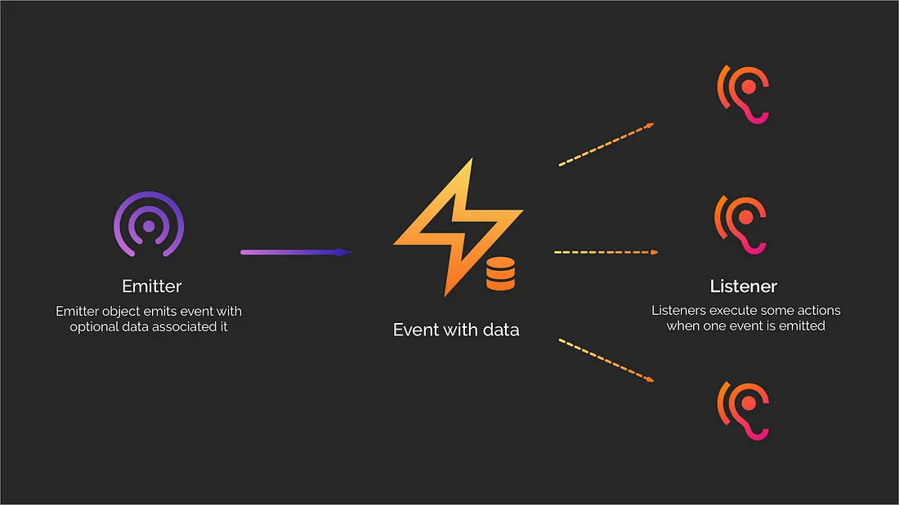

# Topic 3: Event Emitters



### Importing logEvents Module


```jsx
// Importing the logEvents module (assuming it's defined in a file named 'logEvents.js')
const logEvents = require("./logEvents");
```

This line imports the `logEvents` module from a file named 'logEvents.js'. The module is assumed to be in the same directory as the current script. The purpose of this module is not provided in the snippet, but it's referenced later in the code.

### Importing EventEmitter Class

```jsx
// Importing the events module and extracting the EventEmitter class
const EventEmitter = require("events");
```

Here, the 'events' module is imported, and the `EventEmitter` class is extracted. This class allows objects to emit and handle events.

### Defining MyEmitter Class

```jsx
// Creating a new class named MyEmitter that extends EventEmitter
class MyEmitter extends EventEmitter {}
```

This code defines a new class named `MyEmitter` that extends the `EventEmitter` class. Objects created from `MyEmitter` will have the ability to emit and handle events.

### Creating MyEmitter Instance

```jsx
// Creating an instance of MyEmitter
const myLog = new MyEmitter();
```

An instance of the `MyEmitter` class is created, named `myLog`. This object now possesses the capabilities of the `EventEmitter` class.

### Setting Up Event Listener

```jsx
// Setting up an event listener for the 'log' event
myLog.on("log", (message) => {
  logEvents(message);
});
```

This line sets up an event listener on the `myLog` object for the 'log' event. When the 'log' event is emitted, the provided arrow function is executed. This function calls the `logEvents` function (assuming it's defined), passing the event message as an argument.

### Emitting 'log' Event

```jsx
// Emitting the 'log' event with a message
myLog.emit("log", "File emitted successfully!");
```

This line emits the 'log' event on the `myLog` object with the message "File emitted successfully!". This triggers the event listener set up earlier, and the associated callback function is executed, leading to the invocation of the `logEvents` function with the provided message.

Please note that the effectiveness of this code depends on the actual implementation of the `logEvents` function, which is not provided in the given snippet.
